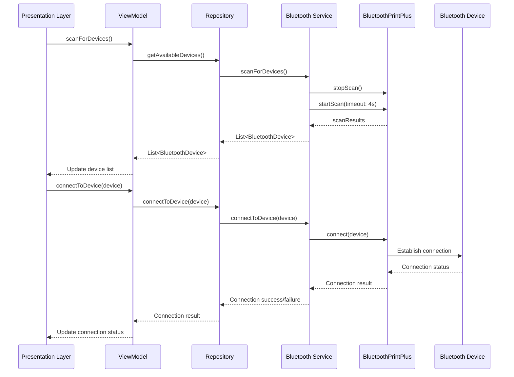
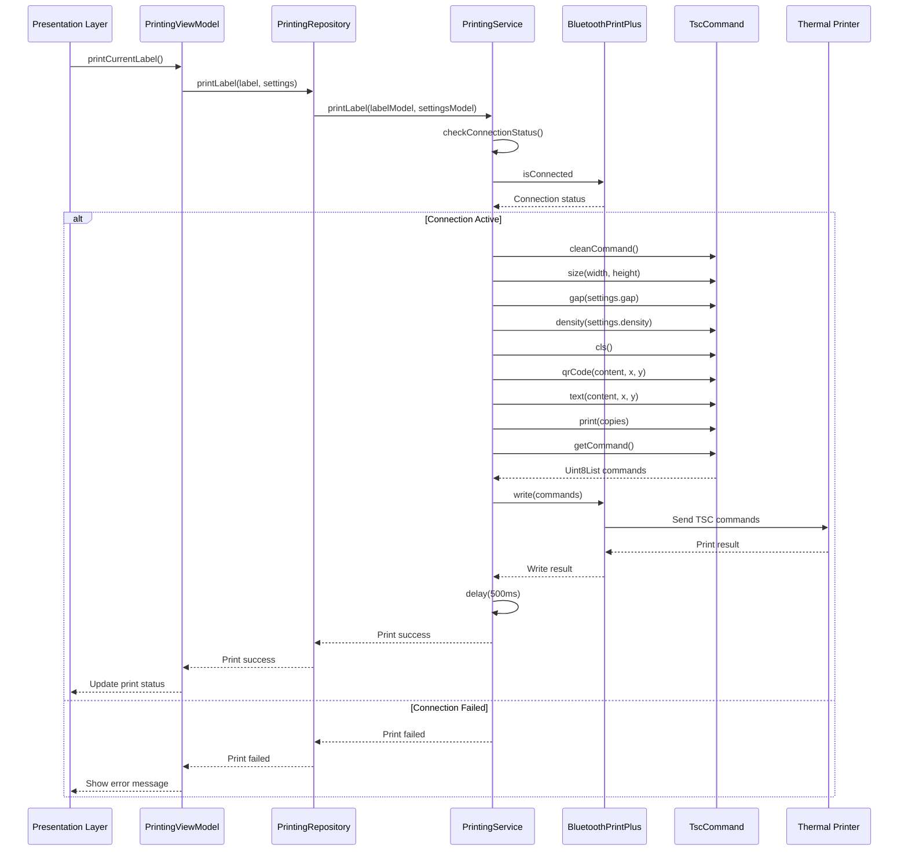
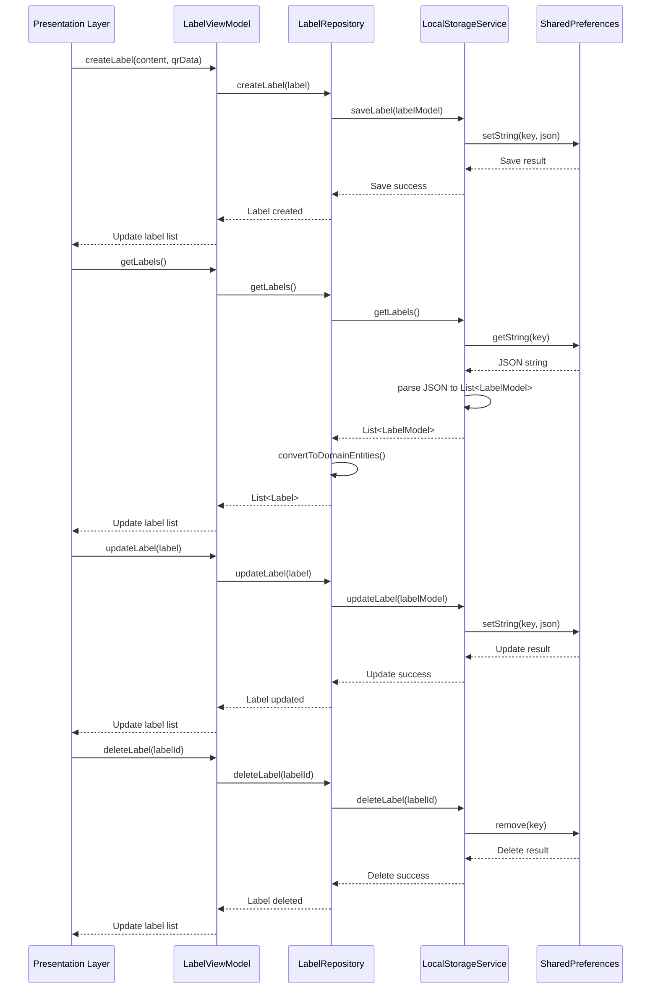
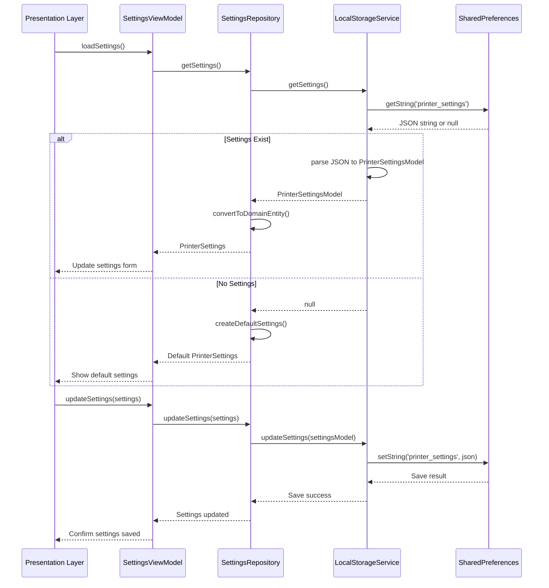
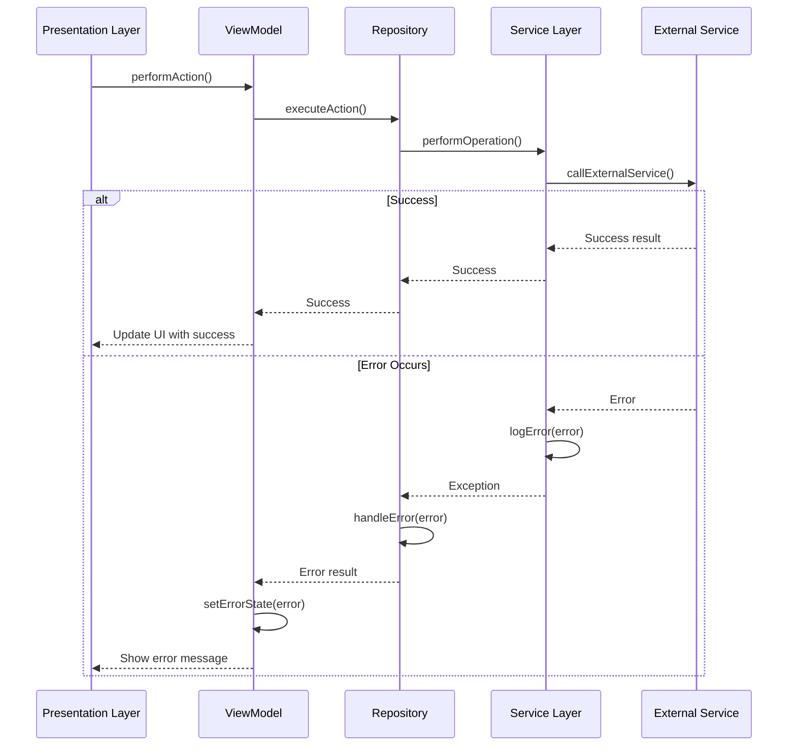
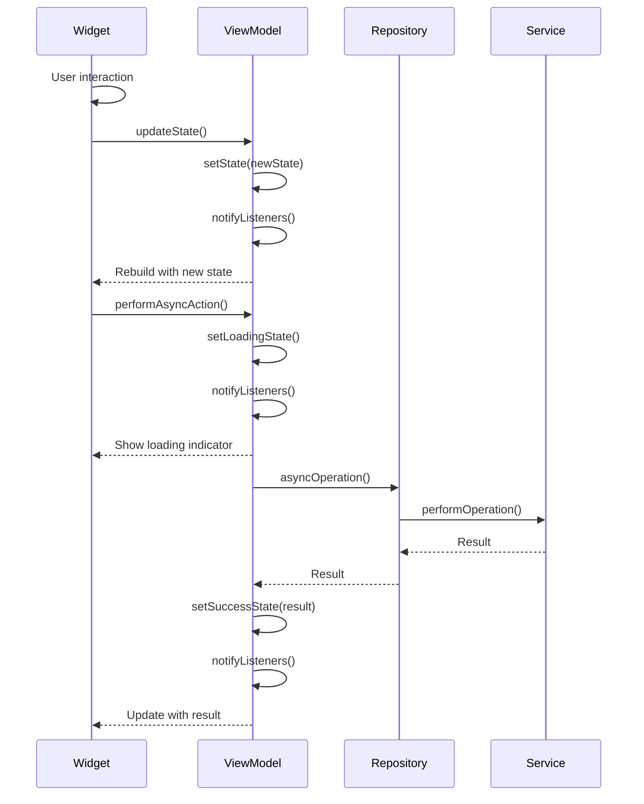
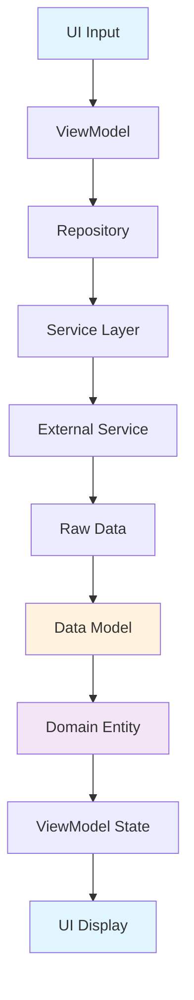

# Data Flow Sequence Diagram

This document illustrates the data flow and sequence of operations in the Label Printing Template application, showing how data moves through the Clean Architecture layers.

## 🔄 Overview

The application follows a unidirectional data flow pattern where:
1. **UI Layer** (Presentation) triggers actions
2. **Domain Layer** contains business logic
3. **Data Layer** handles data persistence and external services
4. **External Services** (Bluetooth, Local Storage) provide platform-specific functionality

## 📱 Bluetooth Connection Flow

## 🖨️ Print Job Execution Flow

## 🏷️ Label Management Flow

## ⚙️ Settings Management Flow

## 🚨 Error Handling Flow

## 🔄 State Management Flow

## 📊 Data Transformation Flow

## 🔧 Key Design Patterns

### 1. **Repository Pattern**
- Abstracts data access logic
- Provides consistent interface for data operations
- Handles data transformation between layers

### 2. **Dependency Injection**
- Services are injected into repositories
- ViewModels receive repository dependencies
- Enables easy testing and modularity

### 3. **Observer Pattern**
- ViewModels notify UI of state changes
- UI rebuilds automatically when state updates
- Maintains loose coupling between layers

### 4. **Command Pattern**
- TSC commands encapsulate printer operations
- Commands can be queued and executed
- Provides consistent interface for printer communication

## 🎯 Benefits of This Architecture

1. **Separation of Concerns**: Each layer has a specific responsibility
2. **Testability**: Business logic can be tested independently
3. **Maintainability**: Changes in one layer don't affect others
4. **Scalability**: Easy to add new features or modify existing ones
5. **Error Handling**: Centralized error handling and recovery
6. **State Management**: Predictable state updates and UI synchronization

## 📝 Notes

- **Async Operations**: All external service calls are asynchronous
- **Error Propagation**: Errors bubble up through layers with appropriate handling
- **State Synchronization**: UI automatically updates when ViewModel state changes
- **Resource Management**: Proper cleanup of Bluetooth connections and streams
- **Logging**: Comprehensive logging at each layer for debugging 